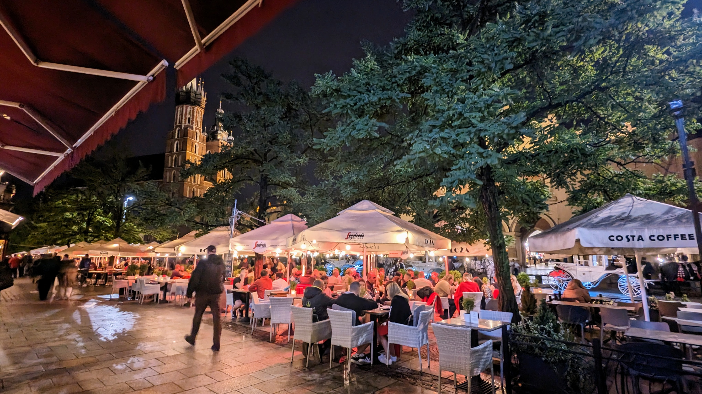

[ [Twitter (en)](https://twitter.com/tanishiking25) | [Twitter (ja)](https://twitter.com/tanishiking) | [linkedin](https://www.linkedin.com/in/rikito-taniguchi-8b372b175/) | [blog (ja)](https://tanishiking24.hatenablog.com/) ]

- 2022 - Present: Scala Compiler/Tooling Engineer @ [VirtusLab](https://www.virtuslab.com/)
- 2021 - 2022: Scala Backend Engineer @ [Alp, Inc.](https://thealp.co.jp/)
- 2021 - 2021: [GSoC for Scala Center](https://github.com/tanishiking/gsoc-2021/blob/main/README.md)
- 2017 - 2021: Full-stack Engineer @ [Hatena](https://hatena.co.jp/)
- 2013 - 2017: Undergrad @ Kyoto University, Dept of Informatics and Mathematical Science, Computer Science Course

